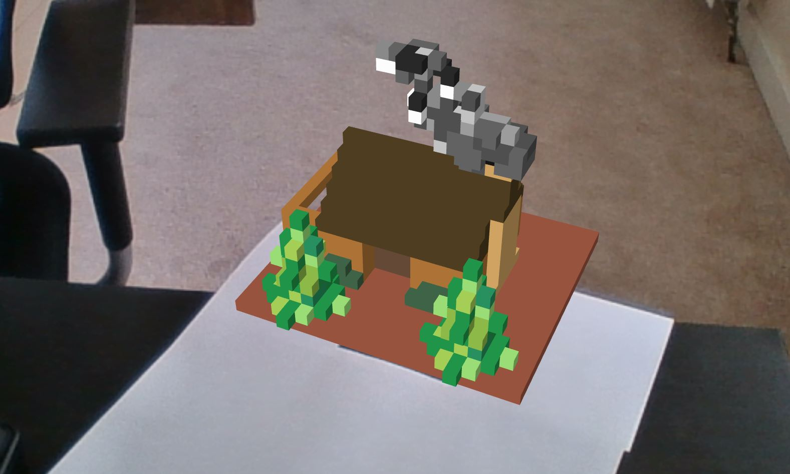

# AR "wooden hut" demo

The source code to match the [blog post](http://builtbyrobert.com/playing-with-in-browser-augmented-reality) I wrote about my first experiences playing with AR in the browser. I made the "wooden hut" using the amazing [MagicaVoxel](https://ephtracy.github.io/index.html?page=mv_main) software.

## How to use
1. Print out a [Hiro marker](https://jeromeetienne.github.io/AR.js/data/images/HIRO.jpg) 
2. Run index.html
3. Have fun!
